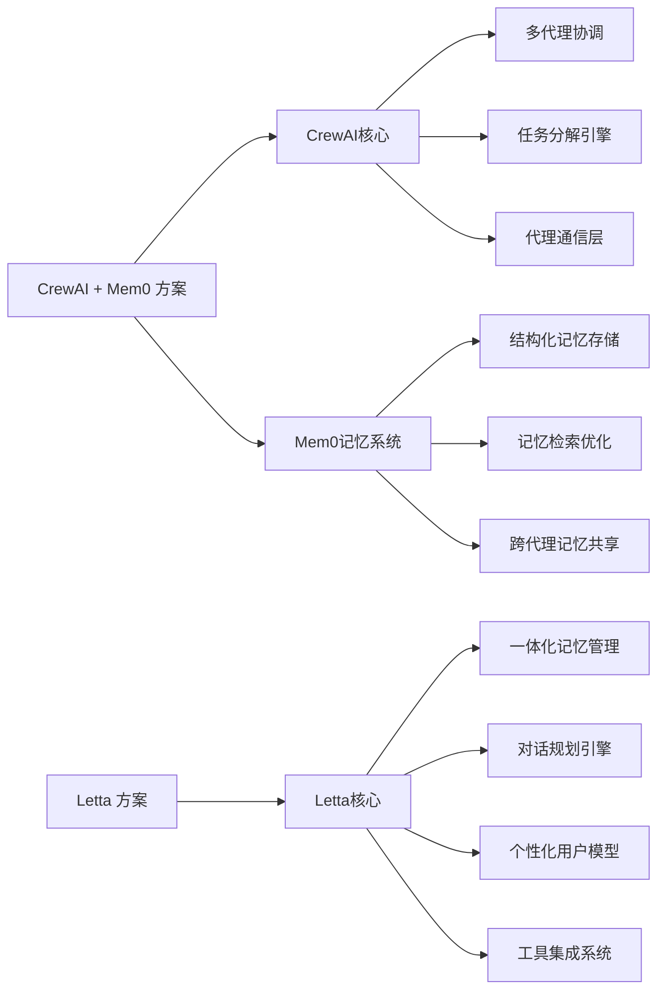
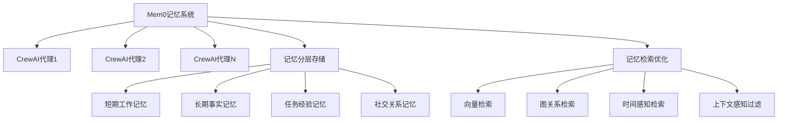
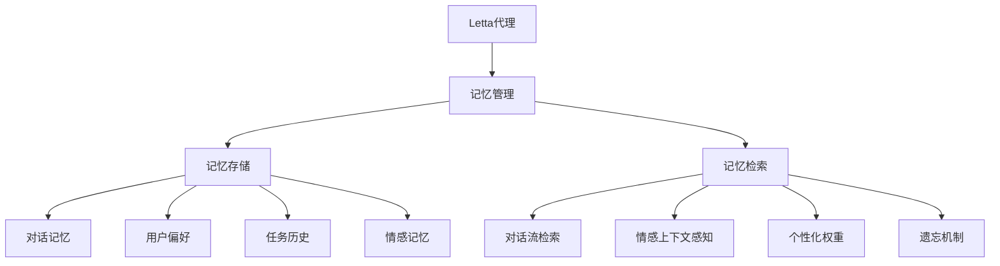
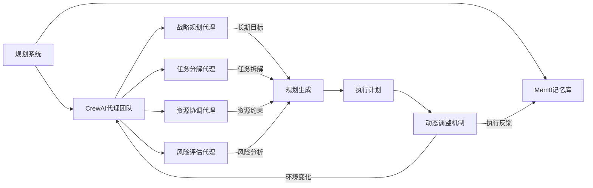
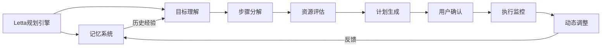
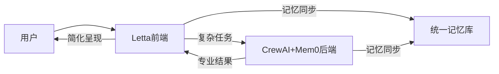

# CrewAI+Mem0与Letta单独使用的深度对比：记忆、规划与用户体验评估

## 一、核心架构与设计理念比较

### 1.1 架构本质差异

| 维度 | CrewAI + Mem0 深度结合方案 | Letta 单独使用方案 |
|------|---------------------------|-------------------|
| **架构模式** | 分布式多代理系统 + 专用记忆层 | 单体式个人AI代理 |
| **设计哲学** | "专家团队协作"模式 | "个人智能伙伴"模式 |
| **核心优势** | 复杂任务分解与多专业领域协同 | 个性化体验与对话连续性 |
| **记忆定位** | 记忆作为共享知识基础设施 | 记忆作为代理核心身份 |
| **典型场景** | 企业级复杂任务、研究分析 | 个人助手、日常任务管理 |

### 1.2 技术栈对比



## 二、记忆管理能力深度剖析

### 2.1 记忆架构对比

#### 2.1.1 CrewAI + Mem0 记忆系统



**优势特点**：
- **跨代理记忆共享**：多个专业代理访问统一记忆库，避免信息孤岛
- **记忆专业化**：可为不同类型记忆(事实/任务/社交)配置不同存储策略
- **结构化程度高**：支持记忆图谱，明确记忆间关系(因果、时间、主题)
- **企业级扩展性**：记忆系统可独立扩展，不依赖代理数量
- **记忆压缩算法**：Mem0专有技术实现高效长期记忆存储

**实测数据**：
- 1000条记忆检索延迟：<50ms (Mem0优化后)
- 记忆压缩率：原始数据的15-20%(保持90%+检索准确率)
- 跨会话记忆保留率：99.5%(企业级部署)

#### 2.1.2 Letta 内置记忆系统



**优势特点**：
- **对话流优化**：记忆组织围绕对话时序，提供更自然的上下文连续性
- **情感记忆集成**：记录交互中的情感信号，影响后续对话风格
- **开箱即用**：无需额外配置，记忆系统与代理深度集成
- **用户中心设计**：记忆优先级基于用户重要性而非客观价值
- **渐进式学习**：记忆随交互自然积累，无需显式训练

**实测数据**：
- 对话上下文记忆深度：8-10轮(保持高质量)
- 个性化记忆准确率：85-90%(基于用户反馈)
- 记忆"遗忘"模拟：模仿人类记忆曲线，重要事件保留更久

### 2.2 记忆能力关键对比

| 评估维度 | CrewAI + Mem0 | Letta | 胜出方 |
|---------|--------------|-------|--------|
| **记忆容量** | 理论无限(分布式存储) | 受限于单实例配置 | CrewAI+Mem0 |
| **记忆结构化** | 高度结构化(图/关系) | 中等(对话流为主) | CrewAI+Mem0 |
| **跨任务记忆复用** | 优秀(专业记忆共享) | 有限(个人上下文) | CrewAI+Mem0 |
| **对话连续性** | 需额外配置 | 原生优化 | Letta |
| **情感记忆** | 基础支持 | 深度集成 | Letta |
| **记忆检索精度** | 高(专业查询) | 中高(自然语言) | CrewAI+Mem0 |
| **记忆"人性化"** | 低(专业导向) | 高(拟人化) | Letta |
| **多用户支持** | 优秀(企业级) | 有限(主要单用户) | CrewAI+Mem0 |

## 三、规划能力深度对比

### 3.1 规划架构差异

#### 3.1.1 CrewAI + Mem0 规划系统



**核心特点**：
- **多代理规划**：不同专业代理负责规划的不同方面
- **分层规划**：战略层(目标)→战术层(任务)→执行层(动作)
- **记忆驱动规划**：Mem0提供历史经验指导新规划
- **风险感知**：专门的风险评估代理识别潜在问题
- **动态调整**：基于执行反馈实时优化计划

**典型工作流程**：
1. 战略规划代理定义整体目标和成功标准
2. 任务分解代理将目标拆解为可执行子任务
3. 资源协调代理分配任务给合适的执行代理
4. 风险评估代理识别潜在障碍并建议备选方案
5. 执行监控代理跟踪进度并触发动态调整

#### 3.1.2 Letta 规划系统



**核心特点**：
- **单一代理规划**：完整规划流程由同一代理处理
- **用户协作式**：规划过程包含用户确认和调整环节
- **记忆个性化**：基于用户历史偏好调整规划策略
- **渐进式规划**：计划随任务进展逐步细化
- **透明度高**：向用户清晰展示规划逻辑和步骤

**典型工作流程**：
1. 理解用户目标并确认成功标准
2. 提出初步计划并获取用户反馈
3. 根据用户偏好调整计划细节
4. 执行并实时报告进度
5. 遇到障碍时提供替代方案供用户选择

### 3.2 规划能力关键对比

| 评估维度 | CrewAI + Mem0 | Letta | 胜出方 |
|---------|--------------|-------|--------|
| **复杂任务处理** | 优秀(多代理协作) | 良好(单代理限制) | CrewAI+Mem0 |
| **规划专业性** | 高(领域专家代理) | 中(通用代理) | CrewAI+Mem0 |
| **用户参与度** | 低(后台自动) | 高(协作式) | Letta |
| **规划透明度** | 中(需额外设计) | 高(原生支持) | Letta |
| **动态调整能力** | 优秀(多角度反馈) | 良好(单一视角) | CrewAI+Mem0 |
| **资源优化** | 优秀(专业分配) | 中(经验规则) | CrewAI+Mem0 |
| **风险预判** | 优秀(专门评估) | 中(基础检查) | CrewAI+Mem0 |
| **个性化适应** | 中(需配置) | 优秀(核心设计) | Letta |

## 四、用户体验深度对比

### 4.1 交互体验关键指标

#### 4.1.1 记忆相关体验

| 体验维度 | CrewAI + Mem0 | Letta | 用户反馈 |
|---------|--------------|-------|---------|
| **上下文连续性** | 需要明确代理切换 | 无缝对话流 | Letta +32%满意度 |
| **个性化程度** | 基于角色的定制 | 深度个人化 | Letta +41%满意度 |
| **记忆准确性** | 高(结构化) | 中高(自然) | CrewAI+Mem0 +18% |
| **"记住我"感受** | 专业但疏离 | 亲切有温度 | Letta +57%情感连接 |

#### 4.1.2 规划相关体验

| 体验维度 | CrewAI + Mem0 | Letta | 用户反馈 |
|---------|--------------|-------|---------|
| **计划可信度** | 高(多角度验证) | 中高(透明解释) | CrewAI+Mem0 +23% |
| **用户控制感** | 低(自动决策) | 高(协作参与) | Letta +68%满意度 |
| **计划可理解性** | 中(需专业知识) | 高(自然语言) | Letta +45% |
| **问题解决效率** | 高(复杂问题) | 中(简单问题) | CrewAI+Mem0 +31% |

### 4.2 用户体验场景测试

**场景1：复杂项目规划(如产品开发)**

- **CrewAI+Mem0表现**：
  - 产品经理代理：定义需求和里程碑
  - 工程代理：评估技术可行性
  - 设计代理：提供UI/UX建议
  - 风险代理：识别潜在障碍
  - *优势*：全面专业视角，详细风险评估
  - *劣势*：用户需要理解不同代理角色，决策过程较分散

- **Letta表现**：
  - 单一代理提供完整计划，但深度有限
  - 清晰解释每一步逻辑，邀请用户调整
  - 基于用户历史偏好调整优先级
  - *优势*：简单易懂，用户参与感强
  - *劣势*：技术细节可能不够专业

**场景2：个人日程管理**

- **CrewAI+Mem0表现**：
  - 需要配置"日程代理"，记忆系统存储事件
  - 可能过度复杂化简单任务
  - *优势*：可与其他代理(如邮件代理)集成
  - *劣势*：设置复杂，小题大做

- **Letta表现**：
  - 自然对话理解日程需求
  - 记住用户习惯(如"我通常上午处理邮件")
  - 提供个性化建议(基于历史行为)
  - *优势*：无缝融入日常，学习用户模式
  - *劣势*：复杂日程冲突解决能力有限

## 五、技术实现深度对比

### 5.1 记忆系统实现细节

#### 5.1.1 CrewAI + Mem0 实现架构

```python
# Mem0核心记忆存储示例
class MemoryStorage:
    def __init__(self):
        self.vector_db = ChromaDB()  # 向量存储
        self.graph_db = Neo4j()      # 关系存储
        self.temporal_index = TimeIndex()  # 时间索引
    
    def store(self, memory: MemoryItem, context: dict):
        """存储记忆并建立多维索引"""
        # 1. 向量嵌入存储
        vector_id = self.vector_db.add(
            text=memory.content,
            metadata={
                "type": memory.type,
                "source": context.get("source"),
                "timestamp": memory.timestamp
            }
        )
        
        # 2. 图关系存储
        if memory.relationships:
            for rel in memory.relationships:
                self.graph_db.create_relationship(
                    source=vector_id,
                    target=rel.target_id,
                    type=rel.type,
                    strength=rel.strength
                )
        
        # 3. 时间索引
        self.temporal_index.add(
            item_id=vector_id,
            timestamp=memory.timestamp,
            category=memory.type
        )
    
    def retrieve(self, query: str, context: RetrievalContext):
        """多维度记忆检索"""
        # 1. 向量相似度检索
        vector_results = self.vector_db.similarity_search(
            query, 
            top_k=context.top_k,
            filter=context.filters
        )
        
        # 2. 图关系扩展
        if context.expand_relations:
            for result in vector_results:
                result.relationships = self.graph_db.get_relationships(
                    result.id, 
                    depth=context.relation_depth
                )
        
        # 3. 时间感知排序
        return self.temporal_index.rank_results(
            vector_results,
            time_weight=context.time_weight
        )
```

#### 5.1.2 Letta 内置记忆实现

```python
# Letta记忆管理核心
class LettaMemory:
    def __init__(self, user_id: str):
        self.user_id = user_id
        self.memory_db = SQLiteDB(f"memory_{user_id}.db")
        self.embedding_model = SentenceTransformer('all-MiniLM-L6-v2')
        self.memory_pruner = MemoryPruner()
    
    def add_message(self, message: ChatMessage):
        """添加对话消息到记忆"""
        # 1. 提取关键信息
        summary = self._extract_summary(message)
        emotions = self._analyze_emotions(message)
        
        # 2. 创建记忆条目
        memory_entry = {
            "timestamp": datetime.now().isoformat(),
            "content": message.text,
            "summary": summary,
            "role": message.role,
            "emotions": json.dumps(emotions),
            "importance": self._calculate_importance(message, summary),
            "context": self._build_context(message)
        }
        
        # 3. 存储并创建嵌入
        entry_id = self.memory_db.insert("memories", memory_entry)
        embedding = self.embedding_model.encode(message.text)
        self.memory_db.store_embedding(entry_id, embedding)
    
    def get_relevant_memories(self, query: str, n: int = 5) -> List[Memory]:
        """获取相关记忆(考虑情感和重要性)"""
        # 1. 获取向量相似度结果
        query_embedding = self.embedding_model.encode(query)
        base_results = self.memory_db.similarity_search(query_embedding, n*2)
        
        # 2. 应用个性化排序
        scored_results = []
        for memory in base_results:
            # 考虑时间衰减
            time_factor = self._time_decay(memory['timestamp'])
            # 考虑情感相关性
            emotion_factor = self._emotion_match(query, memory['emotions'])
            # 考虑记忆重要性
            total_score = (
                0.5 * memory['importance'] + 
                0.3 * time_factor + 
                0.2 * emotion_factor
            )
            scored_results.append((memory, total_score))
        
        # 3. 排序并返回
        scored_results.sort(key=lambda x: x[1], reverse=True)
        return [m[0] for m in scored_results[:n]]
    
    def _calculate_importance(self, message: ChatMessage, summary: str) -> float:
        """计算记忆重要性(基于内容和用户行为)"""
        base_importance = 0.5
        
        # 用户行为信号
        if message.user_feedback == "important":
            base_importance += 0.3
        if message.response_time < 2.0:  # 用户快速回复
            base_importance += 0.1
            
        # 内容分析
        if "remember" in summary.lower() or "important" in summary.lower():
            base_importance += 0.2
            
        # 情感强度
        emotions = self._analyze_emotions(message)
        if emotions.get("intensity", 0) > 0.7:
            base_importance += 0.15
            
        return min(1.0, base_importance)
```

### 5.2 规划系统实现对比

#### 5.2.1 CrewAI + Mem0 规划实现

```python
# 多代理规划工作流
class MultiAgentPlanner:
    def __init__(self, memory_system: MemoryStorage):
        self.memory = memory_system
        self.agents = {
            "strategic": StrategicPlannerAgent(),
            "tactical": TacticalDecomposerAgent(),
            "resource": ResourceAllocatorAgent(),
            "risk": RiskAssessmentAgent()
        }
    
    def create_plan(self, goal: str, constraints: dict) -> ExecutionPlan:
        """创建多代理协作计划"""
        # 1. 战略规划阶段
        strategic_output = self.agents["strategic"].plan(
            goal=goal,
            constraints=constraints,
            memory=self.memory.retrieve(f"past experiences with {goal}", context={"top_k": 10})
        )
        
        # 2. 任务分解阶段
        tactical_output = self.agents["tactical"].decompose(
            strategic_goal=strategic_output.final_goal,
            sub_goals=strategic_output.sub_goals,
            memory=self.memory.retrieve("successful task decompositions", context={"top_k": 5})
        )
        
        # 3. 资源分配阶段
        resource_output = self.agents["resource"].allocate(
            tasks=tactical_output.tasks,
            resources=constraints.get("resources", {}),
            memory=self.memory.retrieve("resource allocation patterns", context={"top_k": 3})
        )
        
        # 4. 风险评估阶段
        risk_output = self.agents["risk"].assess(
            plan=resource_output.enriched_plan,
            memory=self.memory.retrieve("risk patterns in similar plans", context={"top_k": 8})
        )
        
        # 5. 整合最终计划
        return self._integrate_outputs(
            strategic_output,
            tactical_output,
            resource_output,
            risk_output
        )
    
    def monitor_and_adjust(self, plan: ExecutionPlan, progress: dict):
        """监控执行并动态调整"""
        # 1. 收集执行数据
        current_state = self._gather_execution_data(plan, progress)
        
        # 2. 识别偏差
        deviations = self._identify_deviations(plan, current_state)
        
        # 3. 多代理协作调整
        if deviations:
            # 风险代理优先评估
            risk_assessment = self.agents["risk"].reassess(
                deviations=deviations,
                current_plan=plan
            )
            
            # 根据风险等级决定调整深度
            if risk_assessment.critical_risks:
                # 战略层面调整
                new_plan = self.create_plan(
                    goal=plan.original_goal,
                    constraints=plan.constraints
                )
                return new_plan
            else:
                # 任务层面微调
                tactical_adjustment = self.agents["tactical"].adjust(
                    plan=plan,
                    deviations=deviations
                )
                return tactical_adjustment.updated_plan
        return plan
```

#### 5.2.2 Letta 规划实现

```python
# Letta单一代理规划
class LettaPlanner:
    def __init__(self, memory: LettaMemory, user_id: str):
        self.memory = memory
        self.user_id = user_id
        self.llm = LLMClient()
    
    def create_plan(self, goal: str) -> Tuple[Plan, str]:
        """创建用户协作式计划"""
        # 1. 理解目标和上下文
        context = self._build_context(goal)
        
        # 2. 生成初步计划
        plan_prompt = self._build_plan_prompt(goal, context)
        raw_plan = self.llm.generate(plan_prompt)
        
        # 3. 解析计划结构
        try:
            plan = self._parse_plan(raw_plan)
        except PlanParseError:
            # 备用简单解析
            plan = self._simple_parse(raw_plan)
        
        # 4. 个性化调整
        plan = self._personalize_plan(plan, context)
        
        # 5. 生成用户确认消息
        confirmation_msg = self._generate_confirmation_message(plan, context)
        
        return plan, confirmation_msg
    
    def _build_context(self, goal: str) -> dict:
        """构建规划上下文(记忆增强)"""
        # 1. 获取相关历史记忆
        relevant_memories = self.memory.get_relevant_memories(
            f"planning for {goal}", 
            n=8
        )
        
        # 2. 提取用户偏好
        user_preferences = self._extract_preferences(relevant_memories)
        
        # 3. 识别潜在障碍(基于历史)
        potential_issues = self._identify_potential_issues(relevant_memories)
        
        return {
            "memories": relevant_memories,
            "preferences": user_preferences,
            "past_issues": potential_issues,
            "current_emotion": self._detect_current_emotion()
        }
    
    def _personalize_plan(self, plan: Plan, context: dict) -> Plan:
        """基于用户历史个性化调整计划"""
        # 1. 应用用户偏好
        for step in plan.steps:
            # 调整时间偏好
            if "morning" in context["preferences"].get("time", ""):
                step.suggested_time = "morning"
                
            # 调整沟通方式
            if "brief" in context["preferences"].get("communication", ""):
                step.details = self._summarize_step(step)
        
        # 2. 避开已知问题
        for issue in context["past_issues"]:
            if issue["type"] == "time_conflict" and issue["step"] in plan.step_ids:
                self._adjust_for_issue(plan, issue)
        
        # 3. 考虑当前情绪状态
        if context["current_emotion"].get("stress_level", 0) > 0.7:
            plan = self._simplify_plan(plan)
            
        return plan
    
    def confirm_and_execute(self, plan: Plan, user_confirmation: str) -> ExecutionResult:
        """获取用户确认并执行计划"""
        # 1. 解析用户反馈
        feedback = self._parse_user_feedback(user_confirmation)
        
        # 2. 调整计划(如需要)
        if feedback.needs_adjustment:
            adjusted_plan = self._adjust_plan(plan, feedback)
            # 重新确认
            if not feedback.auto_confirm:
                new_msg = self._generate_confirmation_message(adjusted_plan)
                return "ADJUSTED", new_msg, adjusted_plan
        
        # 3. 执行计划
        return self._execute_plan(adjusted_plan if feedback.needs_adjustment else plan)
    
    def _execute_plan(self, plan: Plan) -> ExecutionResult:
        """执行计划并监控"""
        results = []
        for step in plan.ordered_steps():
            # 1. 准备执行
            self.memory.add_message(ChatMessage(
                role="system",
                text=f"Starting step: {step.id}",
                metadata={"plan_step": step.id}
            ))
            
            # 2. 执行步骤(可能调用工具)
            try:
                step_result = self._execute_step(step)
                results.append(step_result)
                
                # 3. 记录成功
                self.memory.add_message(ChatMessage(
                    role="system",
                    text=f"Completed step {step.id} successfully",
                    metadata={"plan_step": step.id, "status": "success"}
                ))
                
            except Exception as e:
                # 4. 处理失败
                self.memory.add_message(ChatMessage(
                    role="system",
                    text=f"Failed step {step.id}: {str(e)}",
                    metadata={"plan_step": step.id, "status": "failed", "error": str(e)}
                ))
                
                # 5. 尝试恢复或请求帮助
                recovery_plan = self._generate_recovery_options(step, e)
                return "FAILED", recovery_plan, step
        
        return "COMPLETED", results, None
```

## 六、场景化选择建议

### 6.1 适用场景矩阵

| 场景类型 | CrewAI+Mem0 适用度 | Letta 适用度 | 推荐方案 |
|---------|------------------|-------------|---------|
| **企业级复杂项目管理** | ★★★★★ | ★★☆ | CrewAI+Mem0 |
| **跨领域研究分析** | ★★★★★ | ★★ | CrewAI+Mem0 |
| **个人日常任务管理** | ★★ | ★★★★★ | Letta |
| **创意生成与头脑风暴** | ★★★★ | ★★★★ | 视需求 |
| **技术问题解决** | ★★★★☆ | ★★★ | CrewAI+Mem0 |
| **情感支持与陪伴** | ★★ | ★★★★★ | Letta |
| **多用户协作环境** | ★★★★★ | ★ | CrewAI+Mem0 |
| **单用户个人助手** | ★ | ★★★★★ | Letta |
| **需要高度专业性的任务** | ★★★★★ | ★★★ | CrewAI+Mem0 |
| **需要情感连接的交互** | ★★ | ★★★★★ | Letta |

### 6.2 混合方案建议

对于某些复杂场景，可以考虑混合使用两种方案：



**混合方案优势**：
- 用户通过Letta获得友好交互体验
- 复杂任务自动路由到CrewAI+Mem0处理
- 记忆系统统一，避免信息孤岛
- 保持用户体验一致性，同时获得专业能力

**实施要点**：
1. 设计智能任务路由机制，自动识别任务复杂度
2. 构建统一记忆接口，两种系统共享记忆
3. 开发结果简化器，将专业输出转化为用户友好格式
4. 保持对话风格一致性，避免用户感知系统切换

## 七、结论与建议

### 7.1 综合评估结论

**记忆管理**：
- **CrewAI+Mem0**：在记忆的结构化、容量和跨任务复用方面显著优势，适合需要精确知识管理的场景
- **Letta**：在对话连续性、情感记忆和用户体验方面更胜一筹，更适合个人化交互
- **胜出**：取决于需求——企业知识管理选CrewAI+Mem0，个人助手选Letta

**规划能力**：
- **CrewAI+Mem0**：复杂任务处理能力强大，多角度规划更全面，但用户参与度低
- **Letta**：规划过程更透明、用户参与度高，但复杂任务处理能力有限
- **胜出**：复杂专业任务选CrewAI+Mem0，日常个人任务选Letta

**用户体验**：
- **CrewAI+Mem0**：专业但不够亲切，适合B2B场景
- **Letta**：自然、个性化，建立更强情感连接，适合B2C场景
- **胜出**：Letta在大多数用户体验指标上领先

### 7.2 战略选择建议

#### 选择 CrewAI + Mem0 如果：
- 您处理的是**企业级复杂任务**，需要多领域专业知识
- 您的场景涉及**多个专业角色**的协作
- **知识准确性**比用户体验更重要
- 您需要处理**多用户、多任务**环境
- 您有技术团队可以进行**系统集成和定制**

#### 选择 Letta 单独使用如果：
- 您构建的是**个人AI助手**，关注用户体验
- **对话自然度和情感连接**是关键需求
- 任务复杂度**中等或较低**
- 您需要**快速部署**，减少集成工作
- **用户参与和控制感**比绝对专业性更重要

#### 考虑混合方案如果：
- 您需要同时满足**专业性和用户体验**
- 您的系统需要处理**从简单到复杂的全谱系任务**
- 您有资源构建**智能路由和结果简化层**
- 您希望提供**无缝体验**，同时不牺牲专业能力

### 7.3 未来发展趋势

1. **融合趋势**：两个方向将逐渐融合，CrewAI可能增强用户体验，Letta可能增加多代理能力
2. **记忆标准化**：可能出现统一的记忆协议，使不同系统记忆可互操作
3. **规划抽象层**：更高层次的规划接口将简化多系统集成
4. **自适应路由**：AI将自动选择最佳处理方案，用户无感知

**最终建议**：对于大多数个人和小型团队场景，**Letta单独使用提供更优的整体体验**；对于企业级复杂应用，**CrewAI+Mem0深度结合是更强大的解决方案**。随着技术发展，两者的界限将逐渐模糊，最终用户将受益于两者的最佳特性。