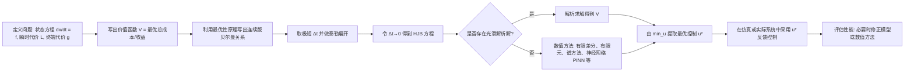

# 连续动态规划与哈密顿‑雅可比‑贝尔曼（HJB）方程——深入浅出全解
下面这份回答会从“普通人也能听懂”的角度，把连续动态规划与哈密顿‑雅可比‑贝尔曼方程讲清楚，包括底层逻辑、具体应用，并给出一个“最精简的全貌”描述。我会先把最重要的结论摆在最前面，然后再逐步展开。
## 一、先给结论：它们到底是什么、有什么用、为什么管用？
- **连续动态规划**：把“随时间连续变化”的决策问题，拆成无穷多个“极短片段”来处理；在每个片段上，都只问“从现在这一刻开始，往后怎么做最好？”——然后把每个片段的答案拼成一整条最优路径。这一思想的核心是“最优性原理”：如果你已经找到了全局最优，那么从中间任意时刻往后的那一截，一定也是从那个中间状态出发的最优。连续时间下这一思想会引出一个偏微分方程，就是HJB方程。
- **哈密顿‑雅可比‑贝尔曼（HJB）方程**：连续时间动态规划的“方程化表达”。它给出的是**价值函数（Value Function）必须满足的条件**：价值函数V(x,t)表示“从状态x、时刻t开始，按最优方式走到终点，总共最好能得到多少收益（或最少花多少成本）”。HJB方程写作：
  - ∂V/∂t + min_u { L(x,u) + (∇_x V)^T f(x,u) } = 0
  - 其中：
    - x：状态（比如车的位置/速度、你的存款）
    - u：控制/决策（比如油门/刹车、消费金额）
    - f(x,u)：系统动力学，描述状态随时间如何变化（dx/dt = f(x,u)）
    - L(x,u)：瞬时“代价”或“花费”（比如油耗、风险惩罚）
    - ∇_x V：价值函数对状态的梯度（方向导数），告诉我们“状态在某一方向上的变化会如何影响未来总价值”
- **一句话精简描述**：  
  **HJB方程就是用微积分把“从现在往后怎么决策最好”这句话写成一个偏微分方程；求解这个方程，就能得到“对每一个状态，现在应该怎么选控制，才能让未来的总收益最大/总成本最小”的最优策略。**
- **为什么它管用（底层逻辑）**：  
  1) 把长期决策拆成“即时代价 + 未来剩余价值”两个部分；  
  2) 在每一刻，都做“此刻的付出+对未来的影响”的整体权衡；  
  3) 要求“无论之后发生什么，从每个中间点出发的做法也都是最优的”，从而把全局优化问题转化成关于价值函数的方程；  
  4) 一旦解出价值函数V(x,t)，最优控制只要对里面的min做取极小即可得到反馈控制律u*(x,t)。
- **它有什么用（典型应用）**：
  - 工程控制与机器人：飞行器轨迹优化、机械臂、自动驾驶的路径规划与避障；机器人队形协调、多智能体无碰撞路径规划。
  - 运筹与库存管理：生产调度、库存补货策略、设备维修更换策略。
  - 经济与金融：最优消费–储蓄/投资组合决策、期权定价（与Black–Scholes方程的内在联系）、宏观增长模型、风险管理。
  - 强化学习（RL）：连续时间RL的理论基础；价值函数和Q函数在连续时间下的“微分方程形式”，为深度强化学习（如Actor–Critic）提供了理论支撑。
  - 能源与电力系统：电力系统经济调度、新能源出力与储能联合优化、电动汽车充/放电策略。
---
## 二、从离散到连续：动态规划的“直觉版”
先用一个“开车回家”的日常例子引入直觉，然后自然过渡到HJB方程的数学形式。
### 1. 离散时间：把旅程切成小段
- 假设你要从公司开车回家，全程可以看作一系列路口选择。在每个路口：
  - 你知道“现在所在的位置”（状态x）
  - 你需要选择“下一步走哪条路”（控制u）
  - 每条路都有“时间成本/油耗成本”（即时代价L）
  - 你的目标：总时间或总油耗最小（性能指标J）
- 动态规划的“最优性原理”说：  
  如果你找到了全程最优的路径，那么从中间任何一个路口往后的那一段路径，也一定是从那个路口出发的最优路径。  
  这就允许我们“从后往前”倒推：  
  1) 先写出“离终点只差一步”的最优选择；  
  2) 再利用这个结果算“离终点两步”的最优选择；  
  3) 一直倒推回起点。
- 对应的“贝尔曼方程”（离散时间）写出来就是：  
  - V_k(x_k) = min_u { L(x_k, u_k) + V_{k+1}(x_{k+1}) }  
  - 这里V_k(x_k)表示“从状态x_k、第k步开始，往后按最优策略走的最小总成本”。
### 2. 连续时间：把小段切成“无穷细”
现实世界是连续的，比如车速、油门都是连续变化。我们把时间切片→0，状态方程从“下一步跳转”变成了微分方程dx/dt = f(x,u)，性能指标从求和变成了积分：
- 系统动力学（状态如何随时间连续变化）：  
  - dx/dt = f(x,u)，x(0)=x0
- 目标（最小化累积成本）：  
  - J = ∫₀ᴛ L(x(t), u(t)) dt + g(x(T))  
  - L：瞬时成本（油耗、能耗、风险惩罚等）  
  - g：终端成本（最后时刻离目标多远、风险多大等）
把离散的贝尔曼方程中的“小步长Δt→0”，就自然推导出连续版本的偏微分方程——HJB方程。
---
## 三、HJB方程的“通俗推导”：为什么长成这样？
这里只讲直觉步骤，不搞繁杂的极限符号。
### 步骤1：定义价值函数
- 定义从状态x、时刻t出发，按最优决策往后走的最小总成本（或最大总收益）为V(x,t)：
  V(x,t) = min_u { ∫_t^T L(x(s), u(s)) ds + g(x(T)) }
### 步骤2：切一个小时间段Δt
- 把从t到T的过程切成两段：
  - 从t到t+Δt（极短的一小段）
  - 从t+Δt到T（剩余大部分）
- 则按最优性原理，从t往后的最优成本可以写成：
  V(x,t) = min_u { [从t到t+Δt的成本] + [从t+Δt继续按最优走的成本] }  
  ≈ min_u { L(x(t), u(t))·Δt + V(x(t+Δt), t+Δt) }
### 步骤3：把“未来的价值”做一阶泰勒展开
- 对V(x(t+Δt), t+Δt)用一阶展开，忽略(Δt)²及更高阶小项：
  V(x(t+Δt), t+Δt) ≈ V(x,t) + (∂V/∂x)ᵀ·dx + (∂V/∂t)·Δt  
  = V(x,t) + (∇_x V)ᵀ·f(x,u)·Δt + (∂V/∂t)·Δt
### 步骤4：代入并整理
- 把展开式代入步骤2，得到：
  V ≈ min_u { L·Δt + V + (∇_x V)ᵀ f·Δt + (∂V/∂t)·Δt }
- 两边消掉V，再两边除以Δt，让Δt→0，就得到HJB方程：
  ∂V/∂t + min_u { L(x,u) + (∇_x V)ᵀ f(x,u) } = 0
### 步骤5：得到最优控制
- HJB方程里的min告诉我们，对每个状态x、时刻t，只要让“即时代价L + 对未来价值的影响(∇Vᵀ·f)”最小，就能得到最优控制u*(x,t)：
  u*(x,t) = argmin_u { L(x,u) + (∇_x V)ᵀ f(x,u) }
---
## 四、底层逻辑：为什么“价值函数”就能统一一切？
把HJB拆解成三个“角色”来理解：
- 角色A：即时代价 L(x,u)  
  代表“现在这一刻的代价/收益”：油耗、体力、金钱、风险等。
- 角色B：未来价值影响 (∇_x V)ᵀ f(x,u)  
  - ∇_x V告诉我们“状态在某一个方向改变一点点，总价值会改变多少”；  
  - f(x,u)告诉我们“如果我们选了u，状态往哪个方向、以多大速率改变”；  
  - 两者的内积，就是“因为现在的控制u，导致未来总价值发生了多少变化”。
- 角色C：时间维度 ∂V/∂t  
  - 如果是有限时域问题（比如在规定时间内赶到目的地），∂V/∂t捕捉“同样状态下，离终点时间越短，未来剩余价值自然越小”。
HJB方程本质上是一个“最优性条件”：每一刻你都在做三件事的统一权衡——  
- 现在的付出（L）  
- 对未来的影响（∇Vᵀ·f）  
- 时间流逝带来的机会变化（∂V/∂t）
这样的“统一权衡”保证了局部和全局都最优，从而把复杂的长期决策转化成关于V的一个偏微分方程。
---
## 五、一张图看懂“HJB求解流程”与“如何拿策略”
下面用Mermaid流程图展示从问题到策略的闭环（这是对许多课程与教程步骤的提炼）：

---
## 六、具体应用：从哪里可以看到HJB的身影？
下面按领域给出一组典型应用，用“普通人也能听懂”的方式说明问题如何被HJB刻画。
### 1) 自动驾驶与机器人轨迹优化
- 场景：小车要在有障碍物的环境中，从起点到终点，时间短、舒适度高且安全。状态x包括位置、速度、朝向；控制u包括油门、刹车、方向盘角速度；即时代价L可能包括对偏离目标、控制量过大、加速度过猛的惩罚；终端代价g确保精确停靠。写出HJB方程并数值求解，就可以得到“从任意状态出发应该怎样转向/加减速”的最优反馈控制。
- 多机器人协调/无人机编队：每个智能体有自己的动力学，避免碰撞和达到编队目标可以写成一个耦合的HJB方程组；微分博弈与纳什均衡条件也常通过HJB框架分析。
### 2) 航空航天与火箭轨迹优化
- 场景：火箭从地面上升到预定轨道，需要在燃料、时间、结构载荷等约束下优化。状态包括位置、速度、质量等；控制包括推力大小与方向；代价包括燃料使用、热流、时间等。把问题写成最优控制，通过HJB（或其相关的必要条件，如PMP）可得到最优推力策略（例如常见“重力转弯”程序）。
### 3) 运筹/生产/库存/设备更换
- 生产调度与库存补货：状态是库存水平、生产产能等；控制是生产量/订货量；即时代价是生产成本+仓储成本；终端代价保证最后库存不过高或过低。HJB给出“在任意库存水平，现在该生产/订货多少”的最优策略。
- 设备维修/更换：状态是设备健康程度；控制是维修或更换的时机与力度；HJB可以给出“在健康度x时，修一下好，还是换一个更好”的最优策略。
### 4) 经济与金融：消费–储蓄/投资组合
- 最优消费–储蓄问题：状态是个人财富；控制是消费金额；目标是在一定时期内最大化折现后的效用。HJB方程给出“在财富w时，最优消费c*(w)以及最优储蓄/投资比例”的策略，经典的新古典增长模型就是用HJB或其对应贝尔曼递归处理的。
- 投资组合与风险对冲：状态是财富、市场因子；控制是各资产配置权重；代价包括风险惩罚/方差、交易成本等；HJB框架下可得到动态对冲和资产配置策略。
- 期权定价与Black–Scholes：用无套利原理，通过自融资组合推导出期权价值满足的偏微分方程，其结构在一定意义上与HJB方程相联系（随机版本的HJB包含扩散项的二阶导）。
### 5) 强化学习（RL）：连续时间理论基石
- 强化学习的核心是“智能体通过交互学习策略以最大化累积回报”。在连续时间下，价值函数满足的正是HJB方程（随机版HJB）。
- Actor–Critic等算法，可以被理解为：  
  - Critic：近似价值函数V或Q函数，即近似HJB方程的解；  
  - Actor：根据∇V或∇Q调整策略，近似执行“min/max H”的最优化。
### 6) 能源与电力系统
- 场景：风电/光伏出力不确定，配电网有负荷、储能装置。状态包括电池荷电、负荷水平、市场价格等；控制包括充/放电功率、机组出力等；HJB可用于实时经济调度、储能策略与风险管理，使在满足安全和物理约束的前提下总成本最小。
---
## 七、求解难与维数灾难：为什么不能直接“手算”？
- HJB方程通常是高度非线性、高维偏微分方程：  
  - 非线性来自f与L的非线性；  
  - 高维来自状态x的维度（比如几十甚至上百）。
- 解析解只存在于少数“好情况”，例如线性系统+二次代价（LQR问题）——HJB退化为Riccati微分/代数方程，能够显式求解。
- 实际中常常采用数值方法：
  - 有限差分/有限元/谱方法等传统PDE数值方法；  
  - “粘性解”理论处理非光滑/间断情况（例如Bang‑Bang控制中控制量在边界间切换）；  
  - 近年来的趋势：用深度神经网络近似V或Q，结合物理信息神经网络（PINN）或强化学习，缓解“维度灾难”。
---
## 八、与庞特里亚金最大值原理（PMP）有何不同、有何关系？
- 动态规划/HJB：从“价值函数”出发，给出一个“充分必要条件”，适合全局分析与反馈控制构造，但在高维时计算困难。
- 庞特里亚金最大值原理（PMP）：从“必要条件”出发，用哈密顿函数和协态变量刻画最优轨线，适合两点边值问题的求解和对最优路径的结构性分析（如Bang‑Bang控制）。
- 关系：在一定光滑性条件下，PMP的必要条件和HJB的充分条件是“等价的”或可以相互导出；二者是同一最优控制问题的两种视角。
---
## 九、回到最初的问题：怎么用最简短的话把它们说全？
- **连续动态规划**：把连续时间里的长期决策问题切成无限个极短的片段，利用“从每一刻往后都必须最优”的原理，得到一组关于价值函数的递推关系。
- **HJB方程**：这个递推关系在时间切片趋于零时的极限形式，是一个关于价值函数V(x,t)的偏微分方程；它表达了“当前选择对即时代价与未来总价值的整体权衡”。
- **底层逻辑**：  
  1) 价值函数V记录了“从某状态/时刻出发，按最优策略走的总收益/成本”；  
  2) 在任意一小段时间里，总价值 = 即时代价 + 剩余价值；  
  3) 优化即刻选择使整个和最小/最大，并对时间取极限，就得到HJB；  
  4) 求出V后，最优控制自然由“对控制变量min/max”得到。
- **应用全貌**：只要你的问题是“随时间不断做决策，追求某个长期最优指标，且状态随决策演化有明确规律”，就可以考虑用HJB/连续动态规划来建模与求解。无论是开车、飞火箭、管库存、理财、训练机器人，还是为强化学习设计算法，HJB都提供了统一的数学语言。
---
## 十、延伸：如果把随机性加进去会怎样？
- 现实中充满随机（市场波动、噪声、突发障碍）。在随机情形下，状态方程变成随机微分方程（SDE），HJB方程会增加一个扩散项（二阶导数），通常写作：
  ∂V/∂t + min_u { L + (∇_x V)ᵀ f } + ½ tr(σσᵀ ∇²_x V) = 0
  这里σ是扩散项系数，最后一项捕捉“随机波动对价值的平均影响”。
- 随机版HJB是金融数学（期权定价、投资组合）、随机控制与风险敏感决策的基石，也为随机强化学习提供了理论框架。
---
## 参考与延伸阅读（来源）
- 贝尔曼方程与动态规划的基本概念与应用领域  
- 连续时间最优控制与HJB的推导和解释（课程讲义）  
- HJB的数学形式与价值函数的详细推导  
- 多智能体/机器人协调中的HJB应用  
- 金融交易与投资组合中的HJB应用  
- 强化学习与HJB的关系及Q函数的HJB方程  
- HJB在运筹/生产/库存/工程控制中的应用综述  
- HJB粘性解与PMP关系的课程讲解
以上内容已经用通俗语言把“连续动态规划”与“哈密顿‑雅可比‑贝尔曼方程”的直觉、数学、应用、难点、与相关理论的关系串联起来，你可以按章节顺序阅读或挑你最关心的部分深入。
